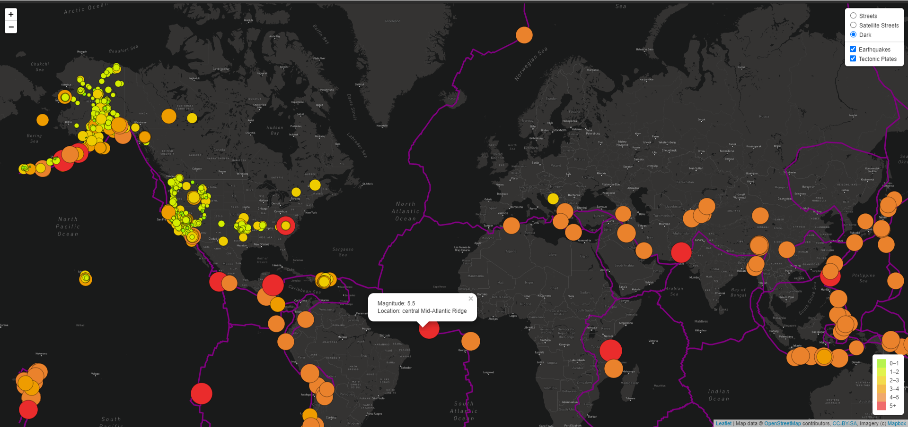

# Mapping_Earthquakes

### The goal of this challenge was to map earthquate activity for the last seven days while also displaying correlating tectonic plate boundaries.

### Technologies used:
- Javascript/html/CSS
- leafletjs
- MapBox